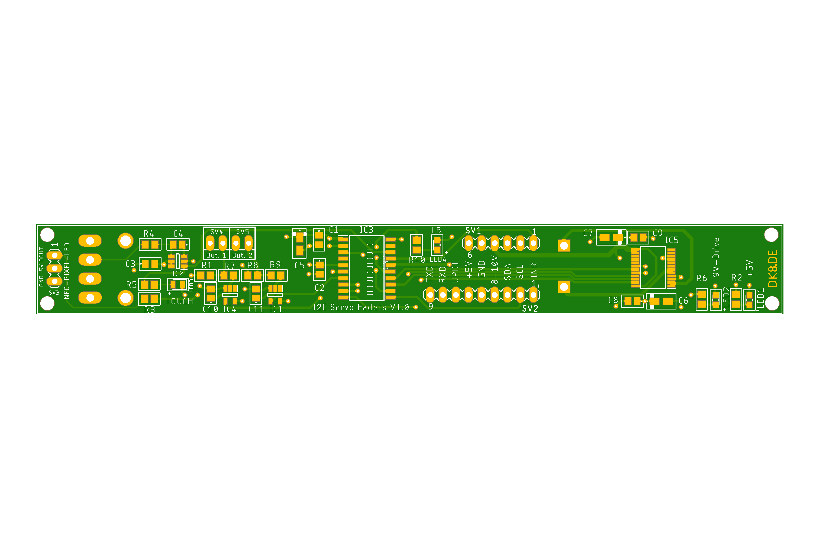

# I2C-Servo-Fader 

> [!CAUTION]
> The project is not yet complete. I am still waiting for the faders and the PCBs. Only then can I finish writing the code for the fader. The code still lacks the motor control in relation to the fader track.
## Description
This project consists of a board for a motor fader, the code for the microcontroller on the board, and a library to control this fader with an Arduino or an ESP32. The compatible faders are:
+ Behringer X-Touch Motor-Fader MF100T
+ Soundwell SM10001NKA0X-HA1
+ RSA0N11M9A0J

Of course, the board can also be adapted for other faders by adjusting the footprint.

### Connections on the Board:
* SDA
* SCL
* +5V for the microcontroller
* 8-10V for the motor
* 1x interrupt pin
* 1x Opt button
* 1x Neo-Pixel-LED
* 1x UPDI

All signals are looped through on the board. This means that several boards can be placed next to each other and easily connected to each other.

## Funktion
The board also has the option to control a NeoPixel LED and an additional button. The NeoPixel LED can be fully controlled via the I2C bus, including RGB color, on, off, and brightness. This allows, for example, changing the color based on the set level or displaying notifications.
The fader has a touch function that can also be evaluated and is internally used to trigger an interrupt. You only need to check when the interrupt line is pulled LOW.
The optional button input can be queried and also triggers an interrupt when pressed.
The interrupt is only reset when the value on the fader that caused the interrupt is read. This ensures that no unnecessary queries are made and no changes are lost.
In the example code, the interrupt line is connected to a pin on the microcontroller that can also trigger an interrupt. This ensures that the microcontroller responds immediately to changes. On an Arduino UNO or Nano, pins 2 and 3 can be used.
To set an I2C address for the fader, you need to connect to the fader using the serial console and simply enter the address in the format 0x08. The address is then stored in ROM and used on the next startup. In theory, you can operate 127 faders on one bus ;-).
The functions of the library are thoroughly documented in I2cServoFader.h, and all functions are used in the example code. The example code also shows how to control multiple sliders.

# Example Code Description
This example code demonstrates how to control I2C servo sliders using an Arduino. The code supports one slider and can be extended to two sliders by uncommenting the relevant sections. The sliders can be controlled via serial commands, and their positions and LED colors can be adjusted based on analog values.

### Serial Commands:
+ sliderpos1=<value>: Sets the position of slider 1 to the specified value (0-255).
+ sliderpos2=<value>: Sets the position of slider 2 to the specified value (0-255).
+ slidertest=1: Initiates a demonstration of slider 1's movement through a series of positions.
+ slidertest=2: Initiates a demonstration of slider 2's movement through a series of positions.

### Interrupt Handling:
When an interrupt occurs, the code reads the analog value and optio state from the sliders, prints these values to the serial console, and updates the LED colors based on the analog values.
The interrupt is triggered by a change in the state of the connected pin (e.g., pin 2).

### LED Color Representation:
+ Green (analog value = 0)
+ Yellow (analog value ≈ 128)
+ Red (analog value = 255)
The LED color transitions smoothly between these values based on the analog value.
# Sources
Part of the circuit board layout is from this project:
https://github.com/GadgetReboot/PSM60_Fader_Controller

# Partlist
This is the BOM. If you don't buy the faders in Germany but from the friendly Chinese, they cost about 12€ per piece.
You can find them on AliExpress here: https://de.aliexpress.com/item/1005006910254678.html

| Part | Value | Package | PART_NUMBER | Price €|
|:--- |:--- |:--- |:--- |:--- |
| C1 | 100nF | C0805 | C0805C104K1RACTU | 0.16 | 
| C2 | 10nF | C0805 | C0805Y103K4RACTU | 0.16 |
| C3 | 100nF | C0805 | C0805C104K1RACTU | 0.16 |
| C4 | 22nF | C0805 | C0805C223K5RAC7210 | 0.09|
| C5 | 10uF | T491A | T491A106M016AT7280 | 0.35 |
| C6 | 10uF | T491A | T491A106M016AT7280 | 0.35 |
| C7 | 10uF | T491A | T491A106M016AT7280 | 0.35 |
| C8 | 100nF | C0805 | C0805C104K1RACTU | 0.16 |
| C9 | 100nF | C0805 | C0805C104K1RACTU | 0.16 |
| FADER | MF100T | SM10001NKA0X-HA1 |  | 20.00|
| IC1 | ATTINY1604-SSN | SOIC127P600X175-14N | ATTINY1604-SSN | 0.70|
| IC2 | AT42QT1010 | SOT95P280X145-6N | AT42QT1010-TSHR | 0.72|
| IC4 | SN74LVC1G14DBVR | SOT95P280X145-5N | SN74LVC1G14DBVR | 0.20 |
| IC5 | TB6612FNG,C,8,EL | SOP65P760X160-24N | TB6612FNG,C,8,EL | 1.35 |
| LED1 | 150080GS75000 | LEDM2012X80N | 150080GS75000 | 0.18 |
| LED2 | 150080GS75000 | LEDM2012X80N | 150080GS75000 | 0.18 |
| LED3 | 150080YS75000 | LEDC2012X80N | 150080YS75000 | 0.18 |
| R1 | 1K | R0805 | | 0.08 |
| R2 | 1K | R0805 | | 0.08 |
| R3 | 470R | R0805 | | 0.08 | 
| R4 | 10K | R0805 | | 0.08 |
| R5 | 1K | R0805 | | 0.08 |
| R6 | 1K | R0805 | | 0.08 |
| SV1 | 0 | MA06-1 | | 0.15 |
| SV2 | 0 | MA06-1 | | 0.15 |
| SV3 | 0 | MA03-1 | | 0.15 |
| SV4 | 0 | MA03-1 | | 0.15 |
| SV5 | 22-23-2021 | 22-23-2021 | | 0.20 |
| PCB ||||2.00|
|T-Lever |||| 1.25 |
|Total |||| ~ 28.00€ |
